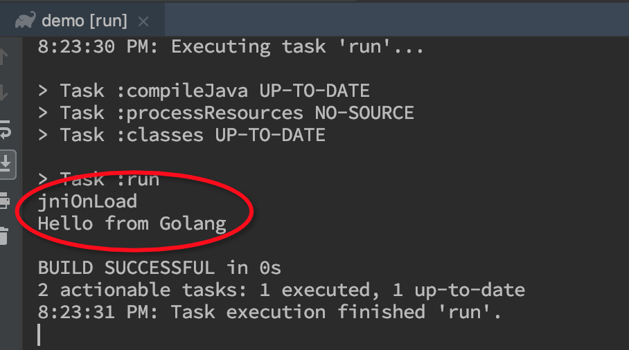

# jnif

JNI 的 Go 语言模板代码生成工具，配合 https://github.com/ClarkGuan/jni 使用，方便 Java 与 Go 之间通讯。

注：本工具用于替换 https://github.com/ClarkGuan/gojni。
gojni 主要借助 Java 语法解析器生成代码，如果解析文件缺少上下文，则很多信息拿不到。jnif 工具解析 class 文件，规避了这类问题。

#### 安装

```bash
go get github.com/ClarkGuan/jnif
```

#### 使用

工具选项说明：

* p: 生成 Go 源文件的 package 名称。默认值 "main"
* o: 生成文件所在目录的路径。默认为 $PWD 的值
* 指定的 jar 或 class 文件或包含他们的目录路径

例如

```bash
jnif go -p hello -o ../helloworld build/java/classes/HelloWorld.class
```

在目录 `../helloworld` 生成文件 `libs.c` 和 `libs.go`。

#### 以 Intellij IDEA 工程举例

1、如下图，创建基于 Gradle 的 Java 工程：


2、Java 工程目录结构如下图，我们创建包含 main 方法的类 —— edu.buaa.demo.Main：


3、修改 build.gradle 文件，注意下图标红处：


4、点击 IDEA 的 gradle 工具栏或直接在 Terminal 中输入 gradle assemble。
此时，可以在 build 目录下找到 Java 编译生成的 class 文件或者 jar 包：


根据 jnif 工具选项说明，上图两处标红的目录使用哪一个都是可以的。

5、创建 Go 工程目录并运行 jnif 工具：

```bash
mkdir -p gopath/src/hello
echo -e "package main\n\nfunc main() {}" >gopath/src/hello/main.go
jnif go -o gopath/src/hello build/libs/demo-1.0-SNAPSHOT.jar
```

这里使用了 jar 包（build/libs/demo-1.0-SNAPSHOT.jar）。执行成功后会发现，`gopath/src/hello` 目录下多了两个文件 `libs.c` 和 `libs.go`：


6、修改新生成的 `libs.go` 文件内如如下：

```go
package main

//
// #include <stdlib.h>
// #include <stddef.h>
// #include <stdint.h>
import "C"

import (
    "fmt"

    "github.com/ClarkGuan/jni"
)

//export jniOnLoad
func jniOnLoad(vm uintptr) {
    fmt.Println("jniOnLoad")
}

//export jniOnUnload
func jniOnUnload(vm uintptr) {
    fmt.Println("jniOnUnload")
}

// Class: edu/buaa/demo/Main
//
// Class : edu.buaa.demo.Main
// Method: private static native java.lang.String helloFromJni()
//
//export edu_buaa_demo_Main_helloFromJni
func edu_buaa_demo_Main_helloFromJni(
	env uintptr,
	clazz uintptr /* java.lang.Class */) uintptr /* java.lang.String */ {
	jenv := jni.Env(env)
	return jenv.NewString("Hello from Golang")
}
```

7、使用 go build 命令构建动态库文件（以 darwin 平台为例）：

```bash
GOPATH=$PWD/gopath:$GOPATH CGO_CFLAGS="-I$JAVA_HOME/include -I$JAVA_HOME/include/darwin" go build -buildmode=c-shared -ldflags="-w -s" -x -v -o libhello.dylib hello
```

注意：

* 设置 GOPATH 环境变量的设置尤为关键。要求可以找到我们的 `hello` 工程，并且也在之前运行过 `go get github.com/ClarkGuan/jni` 下载 jni 相关的 library
* 设置 JAVA_HOME 环境变量，指向 JDK 目录
* 这里测试环境是 MacOS，所以引入的 JNI 头文件路径包括 `$JAVA_HOME/include/darwin`，如果是其他平台需要修改这里

如果编译顺利，会生成 libhello.dylib 动态库文件，后面运行 JVM 时需要它。

8、启动 java 环境，运行 main 函数。我们可以直接运行

```bash
gradle run
```

可以看到输出：


